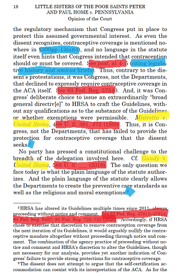

```{r setup, include=FALSE}
knitr::opts_chunk$set(echo = TRUE)
```

## Solves Some Problems!

My project is studying the oral arguments and opinions that the Supreme Court has had since they started hearing arguments by telephone in early 2020. Basically, I'm comparing what justices say at argument to what they write in their opinions.

My goal so far has been to figure out how much processing of my text can be done automatically, and how much needs to be done manually. I'm happy to report that I was able to extract everything I wanted from oral arguments automatically! But I soon learned that this was, by far, the easy part.

**Oral Arguments**  

Oral argument transcripts look like this:  


  
First, I had to get the part of the file I want for analysis.
There's some info before and after every argument that I wanted to delete. Thankfully, every argument begins with the Chief Justice announcing the case. So I just needed regex to find where in the text his name first appears:

```{r eval=FALSE}
text_withoutIntro <- str_match(text,"(?=CHIEF JUSTICE ROBERTS).*") # get me all the text starting with the first "CHIEF JUSTICE ROBERTS"
```

I don't want the appendix though, so I also need to find the end of the argument. Every case ends with Roberts saying "the case is submitted," but breaking on the word "submitted" would likely fail quite often. However, there's always a note right after that says "(Whereupon, the case was submitted.)"
```{r eval=FALSE}
text_withoutIntro <- str_match(text_withoutIntro,".+?(?=Whereupon)")
```

Hooray! If you ever argue in front of the Supreme Court, please don't use the word "whereupon," or you might break my future projects.  
***

Once I got the text I wanted, it was easy to clean. I came up with a function, because I figured I would need to do this a lot:

```{r eval=FALSE}
clean_text <- function(text){
  str_replace_all(text,"\\<[^>]*>","") %>% #remove html
    {str_replace_all(.,"\\r\\n","")} %>% #remove linebreaks
    {str_replace_all(.,"\\\\","")} %>%  #remove errant "\\"s
    {str_replace_all(.,"\\sn\\s"," ")} %>% # remove " n "
    {str_replace_all(.,"\\s+",' ')}  # flatten all whitespace into single
}
```
This gets almost all of the unnecessary text out. There's also the issue of the line numbers--I don't want them:
```{r eval=FALSE}
for(i in 0:25){
  text <- gsub(i,"",text)
}
```
There has to be a better way to do that...  
This also runs the risk of deleting numbers spoken at argument, but I'm not sure if the Court writes out numbers.

Now I have a list of the relevant text without numbers. 
Next, I wanted to break it down into a data frame, with each time a justice speaks being a separate row, with a column for their name.
Basically, I wanted to extract "JUSTICE KAGAN: blah blah blah," without deleting the "JUSTICE KAGAN:" part.
I agonized over this, mostly because R doesn't allow unbounded lookarounds and I couldn't figure out how to solve the problem that way.

My solution:
```{r eval=FALSE}
locations <- str_locate_all(text,"[A-Z][A-Z. ]*:")
```
Make a list of the index of each "JUSTICE NAME:" string. Then, make another list of the text broken at each index.
Once we remove the "JUSTICE NAME:" string from every string, we can add that to a column called speaker:


Now we can start pulling out every time a specific justice speaks, and make a corpus of their words at argument! There's some interesting info we can find in this, but the interest is in comparison.
Arguments have some meta information, such as what case it is, and who the people arguing are and represent. The actual text has two pieces of information: the speaker, and their speech.

Opinions, on the other hand...

## But Regex Can't Solve Everything!

Have so, so much information in them.  


  
There is a lot of information here. What I want is to extract the words the Justice writes. Even identifying what this is isn't trivial!  

•	Quotes are interesting, but do we need to know they're quoting something else?  
•	Citations aren't interesting, but do we want to preserve what case the quote came from?  
•	Do we care that text is in a footnote? (and how would we tell a computer to capture it, and where to include it, if we do?)  

If you know how to use regex to get a computer to ignore what's in red, assign what's in yellow as a property of the previous sentence, and possibly handle what's in blue some other special way, please let me know.  

  
Anyway, the past couple of days have been me manually slogging through editing opinions while deciding what information I want.  
It should be trivial to grab and clean the text once I finish manually formatting the files.  
Then, we can begin comparing texts and doing all sorts of interesting things like trying to predict who wrote a given opinion, or even predict future votes!

**But, for now, a few hundred pages down, a few hundred to go!**
