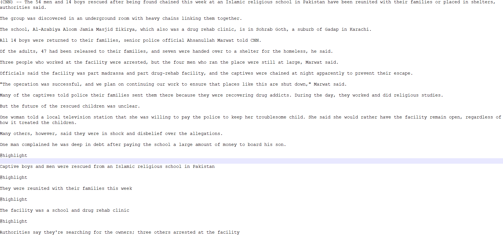

```{r setup, include=FALSE}
knitr::opts_chunk$set(echo = TRUE)
```

## Data

I'm using the **CNN/DailyMail dataset**, which consists of approximately 300,000 news stories from CNN.com and dailymail.co.uk. This corpus was first introduced by Hermann et al. in "Teaching Machines to Read and Comprehend" (2015). 

### Downloading the data

The pre-processed data is available from NYU [here](https://cs.nyu.edu/~kcho/DMQA/). The CNN and Daily Mail corpora are available as two separate compressed files. I downloaded both. 

They are *big* files. For perspective, the *compressed* version of the Daily Mail corpus is 1 GB. (Just unzipping the Daily Mail corpus took about 10 minutes on my machine.) For now, I'm sticking to the CNN corpus, as my machine is struggling a bit under large processing tasks (eg. finding bi-grams), and I suspect that adding the Daily Mail corpus (which is over twice the size of the CNN corpus) to the mix may be too much for it to handle. I may look into working on a math department cluster instead of my local machine, if over the next few weeks I feel like the second corpus is necessary for my project. 

Unzipping the CNN corpus yields a directory in which each text is stored as a separate file.

### Reading in the data

The main obstacle I ran into was the file format of the texts -- each article is a separate .STORY file. What is a .STORY file, and how do you read it into R?

First, I took a look at the files themselves by opening them up in a text editor. Each looks like a plain text file containing the text of the article followed by several, brief one-line summaries, each preceded by the string "@highlight"  (see image). Each text begins with a string like "*Location* (CNN) --". (These details will be useful to know when processing the texts.) 



#### Using the scan() function 
Second, I did some research into how to load the .STORY files into R. Because these texts aren't in tabular form, the usual suspects like *read.table(), read.delim()*, etc. aren't optimal. I found two functions, *scan()* and *readLines()*, that are meant for unstructured text data like mine.

I first played around with *readLines()*, which takes a singe filepath as an argument. By default, this function outputs a character vector, where each element is a line/sentence of the text. *scan()* is a similar function, but has more flexibility  for how it reads in data -- *scan(filepath, what = "character", sep = "\n")* returns the same thing as *readLines()*, except without extra blank elements (*readLines()* doesn't skip empty lines). I will proceed with *scan()* for this reason.

Recall that *scan()* reads each article into a character vector, where each line of the article is a separate element. Looking back to how the Harry Potter corpus was structured, I think I need to adjust this -- and instead, store each article as a vector of length 1 (with only 1 element, containing the entire text). That way, I can store the corpus as a character vector, of which each element is an article. To collapse the articles into a 1-length vector, I use the *paste()* function.

#### Putting it all together

This is the code I wrote to read in all of the CNN texts. Unfortunately, loops are slow -- especially given that there are almost 100k texts to loop through, just for the CNN corpus. This script took about 15 minutes on my machine.

```{r, eval=FALSE}
## Get file paths for each text in CNN corpus
files <- list.files(path="C:\\Users\\gnagu\\Documents\\S21\\text as data\\cnn_stories\\stories", pattern="*.story", full.names=TRUE, recursive=FALSE)

## Create helper function to read in and format texts
read_story <- function(path) {
  article <- scan(path, what = "character", sep = "\n")
  article <- paste(article, sep = "", collapse=" ")
  return(article)
}

## Create corpus of texts (CNN)
cnn <- vector(mode = "character", length = length(files))

for (i in seq_along(files)) {
  cnn[i] <- read_story(files[i])
}

## Remove file paths from memory (it's a large-ish object, and we no longer need it)
remove(files)

## Save formatted corpus as an R object, so I don't need to run this script again in future
save(cnn, file = "cnn_data", compress = TRUE)
```

Now we have a character vector *cnn*, of which each element is a separate article. I've saved this object to memory, so I don't have to run this script again in future.

We can finally convert it to a corpus and get some descriptive statistics. I use the *corpus()* function in quanteda to do this.

### Descriptive statistics

I used the *summary()* function in quanteda to get descriptive statistics on the corpus. I initially made a mistake by not realizing that by default, *summary()* only looks at the first 100 texts in the corpus! Not knowing how the texts are ordered in the corpus (ie. randomly or not), this initial summary could have been rather skewed.

I then ran *summary(cnn_corpus, n = length(cnn))* to summarize all 92,579 texts in the corpus. Doing so made my computer's fan run very loudly (ie. took a fair bit of processing power), but it executed relatively quickly in under a couple minutes. If working with a much larger corpus, it may be a good idea to summarize a random subset of texts.

* There are exactly 92,579 texts in the CNN corpus. 

* The articles range between 1 and 173 sentences in length. 

* Out of the corpus of 92579 texts, 105 of them are 1 sentence long. As we would expect, most of these texts are short in length (ie. have fewer than 150 words). However, I was curious about the 3 texts longer than that (all of which turn out to be > 400 words, ie. are much longer than we would think a 1 sentence article should be). These extra-long "1 sentence" articles turned out to be "list" texts -- ie. a list of American Country Awards winners, a list of World Cup tournament groupings, and a list of World Cup results. These texts are not representative of the rest of the corpus, which are written in full sentences. Hence, I may consider dropping them from the corpus.

* On average, articles are about 33 sentences or 802 words long. 